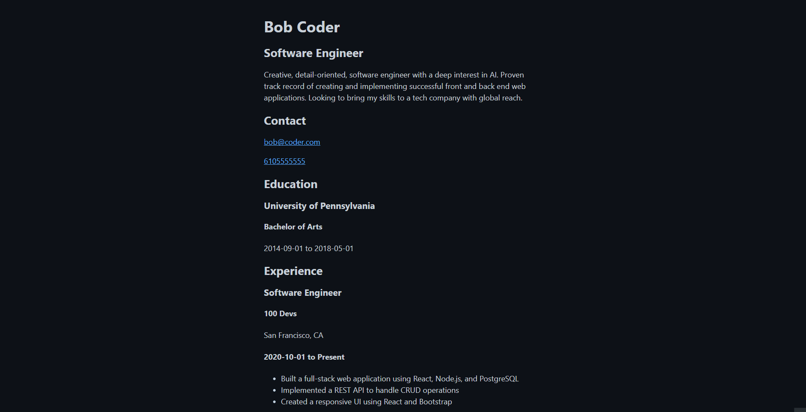

# Resume as a Website and API
Resume as a Website is an API that helps you display your resume as a website.

## Demo
<p align="center" width="100%">
    
</p>

## Live Preview
[Live Preview](https://resume-api-template.onrender.com)

## Tech Stack
HTML, CSS, JavaScript, Node.js, Express, EJS

## API Reference
#### Get all resume fields
```bash
  GET /resume
```

#### Get contact
```bash
  GET /contact
```

#### Get education
```bash
  GET /education
```

#### Get experience
```bash
  GET /experience
```

#### Get projects
```bash
  GET /projects
```

#### Get skills
```bash
  GET /skills
```

#### Get socials
```bash
  GET /socials
```

## Run Locally
Clone the project

```bash
  git clone https://github.com/neilmcgu/resume-api-template.git
```

Go to the project directory

```bash
  cd resume-api-template
```

Install dependencies

```bash
  npm install
```

Start the server

```bash
  node server.js
```

## Usage/Examples
Navigate to the `main.js` file which can be found in `./public/assets/js`

Find the instantiated object, shown below, and edit all the values to your personal deletes.

```javascript
const resume = new Resume();

resume.name = "Bob Coder";
resume.title = "Software Engineer";
resume.email = "bob@coder.com";
resume.phone = 6105555555;
resume.education = [
  {
    school: "University of Pennsylvania",
    location: "Philadelphia, PA",
    degree: "Bachelor of Arts",
    major: "Economics",
    startDate: "2014-09-01",
    endDate: "2018-05-01",
  },
];
resume.summary =
  "Creative, detail-oriented, software engineer with a deep interest in AI. Proven track record of creating and implementing successful front and back end web applications. Looking to bring my skills to a tech company with global reach.";

...
...
...
...
```

## Roadmap
- Add API reference as a view
- Improvement in style to match a standard resume format and improve readability
- Exception handling for missing fields
- Form integration so users can upload their resume file or form addition with input fields for each field that will then generate the resume page for the user

## Lessons Learned
When building out an API you can really go wild with the routes and include one for every piece of information

## 🔗 Links
[](LINK HERE)

[](LINK HERE)

[](LINK HERE)


## License
[MIT](https://choosealicense.com/licenses/mit/)

